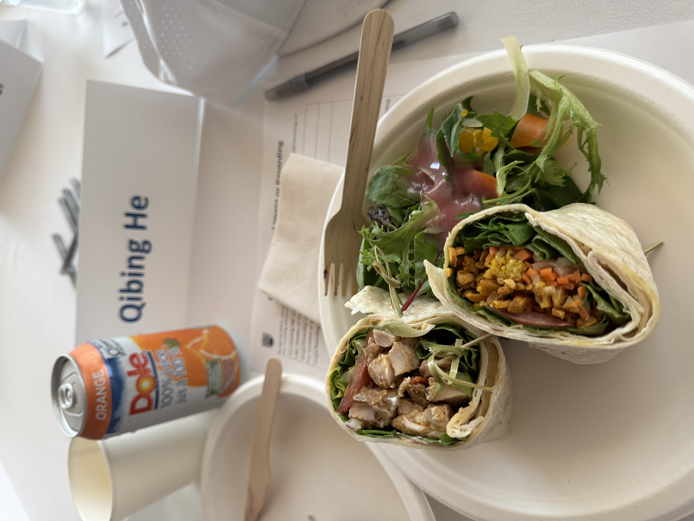

My first weeks in the MDS program have been exciting and full of new experiences. During orientation, I participated in a bingo icebreaker activity that encouraged us to introduce ourselves and learn more about one another. It was a fun way to begin conversations and become more comfortable in a new environment.

Through the activity and other orientation events, I met many new friends from a wide range of professional and educational backgrounds. I also had the opportunity to meet MDS alumni and learn about their experiences in the program. Speaking with them helped me gain a clearer understanding of what to expect from the program and how the skills we develop can be applied after graduation. We also shared lunch during orientation, which gave us time to continue our conversations in a relaxed setting.

During the first week of classes, I began to understand how the different courses fit together. In DSCI 511, I started learning the foundations of programming with Python. DSCI 521 introduced Git, GitHub, the terminal, and data science workflows, while DSCI 523 focused on R and data processing. In DSCI 551, I began reviewing the foundations of probability and statistics. Although the first week introduced many new tools and concepts, it made me excited to see how these subjects will connect throughout the MDS program.